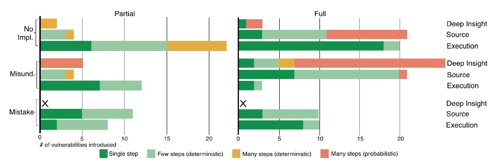

## 1. 来源
[Votipka D, Fulton K R, Parker J, et al. Understanding security mistakes developers make: Qualitative analysis from build it, break it, fix it[C]//Proceedings of the 29 th USENIX Security Symposium (USENIX) Security. 2020, 20](https://www.usenix.org/conference/usenixsecurity20/presentation/votipka-understanding)

## 2. 概述
如何安全地开发软件一直以来都是一项难题。文章调查了程序员为什么以及如何犯下了安全错误，即使已经有了一些安全经验。作者研究了安全编程竞赛中提交的94份作品，手动分析并标记了漏洞类型。研究发现，低级的错误占比较少且容易被自动化工具发现，但更多的安全错误是对安全需求的未实现和对安全概念的误解。最后作者反思总结了在API安全、API文档、检测工具和安全培训上的改进。

## 3. BIBIFI竞赛介绍
"Build it, Break it, Bix it"提出一个中小型的项目需求，不限制开发语言，要求参赛者开发出符合要求的程序。这样的程序在一定程度上符合现实，既不会像实验环境那样理想化，又不会像真实生产和用户环境那样庞大和复杂。

竞赛分三个阶段： 
1. 按要求开发程序；
2. 挖掘其他参赛者作品的漏洞；
3. 修复自己作品中的漏洞。

## 4. 安全场景

1. 日志安全：  
在实现日志功能的基础上，保障日志文件的机密性和完整性，阻止攻击者的访问和篡改。
2. 通信安全：  
在实现C/S通信模型的基础上，保证通信内容的机密性和完整性，并防御中间人攻击、重放攻击、侧信道攻击等。
3. 数据库安全：  
在实现键值对数据库的基础上，配置基于角色的访问控制和自主访问控制策略，阻止未经授权的访问。

## 5. 定性分析

### 5.1 类型
需求未实现  | 需求误解 | 低级错误     
----------  | -------- | --------     
未加密      | 非键函数 | 错误检测不足 
没有（完整的）访问控制 | 弱密码算法 | 未捕获的异常
完整性校验确实 | 自制密码算法 | 控制流错误
侧信道攻击防御 | 弱访问控制 | 跳过算法流程
报文重放检查 | 内存损坏 | 空指针写入
递归委派检查 | 固定值 |    
    | 随机性不足 |  
    | 仅数据子集安全 |  
    | 未能处理的输入 |  
    | 禁用保护措施 |  
    | 资源耗尽 |  

举例：未加密日志文件和通信内容，未对日志设置MAC，授权管理错误，strcpy的使用（我认为是低级错误），硬编码的口令、质询随机数、初始向量，基于时间戳的质询而接受窗口阈值过高，为每条日志设置MAC但可以删除复制和重排序，使用内容加密的HTTP但Header仍可被修改。

### 5.2 发现难度，利用难度和控制范围

发现难度：需求误解 > 未实现 > 低级错误  
利用难度：需求误解 ≈ 未实现 > 低级错误  
控制范围：无显著区别 

## 6 结论

### 6.1 统计分析
1. 不理解安全概念很常见
2. 隐藏的、非直观的安全需求容易被跳过
3. 无法正确使用安全原语
4. 越复杂的代码错误越多
5. 越流行的语言错误越多
6. 没有显著数据证明安全培训或开发经验对安全开发有帮助

### 6.2 作者提出的安全措施有效性及优先级排序
1. 另请高明
2. 更安全的API设计
3. 更好的文档
4. 安全教育
5. 安全分析工具
6. 安全考核